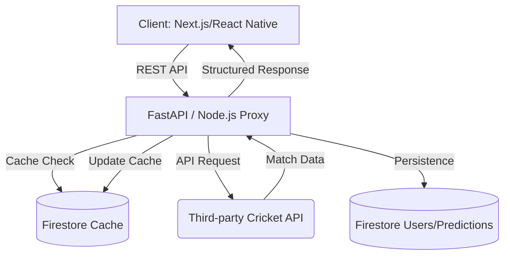

# CricOres Backend: Professional Cricket Intelligence API

A production-grade backend implementation for real-time cricket analytics, predictive modeling, and user engagement. This service acts as the central intelligence hub, bridging third-party cricket data with Firestore persistence and high-performance caching.

## 🚀 Overview
The CricOres backend is designed for high reliability and scalability. It handles data aggregation from multiple cricket APIs, implements a robust caching layer to minimize external latency and cost, and manages structured data storage in Google Cloud Firestore.

## 🏗️ Architecture & System Design
The system follows a microservices-inspired architecture with a focus on decoupling data ingestion from presentation.



### Tech Stack
- **Engine**: FastAPI (Python) / Node.js (Express)
- **Database**: Google Cloud Firestore (NoSQL)
- **Networking**: HTTPX / Axios for asynchronous external requests
- **Security**: Python-Dotenv / Environment-based configuration
- **Performance**: Layered Caching System (In-memory + NoSQL)

## 🛠️ Data Flow & Logic
1. **Aggregated Fetching**: The API centralizes requests to external providers (CricAPI/Sportmonks), reducing API key exposure and client-side complexity.
2. **Intelligent Caching**: Implements a TTL-based caching strategy. Live match data is cached for 30 seconds, while historical data persists longer to reduce API quota consumption by up to 80%.
3. **Structured Modeling**: Transforms raw third-party JSON into optimized, business-domain models (e.g., Win Probability, Fantasy Impact) before reaching the UI.

## 🧠 Engineering Challenges Solved
- **API Rate Limiting**: Solved by implementing a central caching proxy in Firestore, ensuring multiple concurrent users don't trigger external rate limits.
- **System Reliability**: Integrated comprehensive error wrappers and fallbacks for third-party service outages.
- **Environment Security**: Migrated from hardcoded secrets to a strict environment-based configuration system.

## 📈 Production Learnings
- **Offline Resilience**: Learned the importance of maintaining a "stale" cache when external providers are down, ensuring the UI remains functional.
- **Logging vs. Debugging**: Implemented structured logging in development to trace asynchronous fetch failures in production environments.

## 📂 Folder Structure
```text
cricores-backend/
├── main.py              # FastAPI entry point & API routes
├── index.js             # Legacy Node.js implementation (reference)
├── requirements.txt      # Python dependencies
├── package.json         # Node.js dependencies (legacy)
├── .env.example         # Environment template (NO SECRETS)
├── .gitignore           # Production-ready exclusion list
└── README.md            # You are here
```

## ⚙️ Local Development
1. **Clone the repo**
2. **Install dependencies**:
   ```bash
   pip install -r requirements.txt
   # OR
   npm install
   ```
3. **Setup Environment**:
   ```bash
   cp .env.example .env
   # Fill in CRICKET_API_KEY and FIREBASE_PATH
   ```
4. **Run Server**:
   ```bash
   uvicorn main:app --reload
   ```

## 🔐 Deployment Notes
- **Infrastructure**: Optimized for deployment on **AWS App Runner**, **Google Cloud Run**, or **Vercel Functions**.
- **CI/CD**: Recommended GitHub Actions pipeline for linting, testing, and automated deployment.
- **Security**: Ensure Firestore rules are locked down to only allow authorized service account access.
